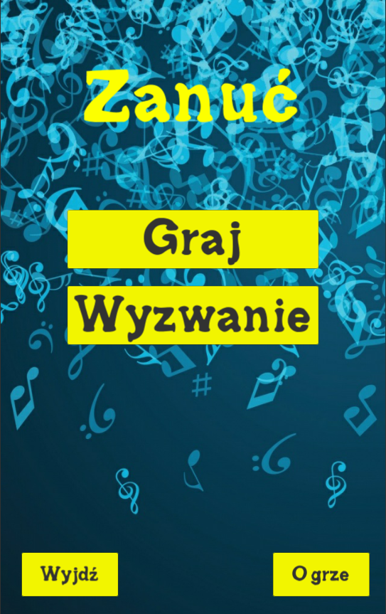
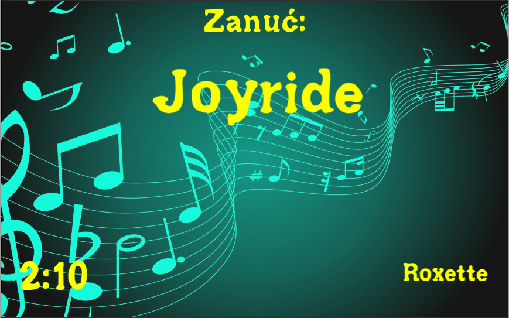

# Project Name
> A 2D game created on mobile devices with Android system. It is similar game to popular “Czółko”. One of the players takes the smartphone and turns it around. Other players see the screen on which the title and the artist of the song is shown. Their task is to croon the song without using words so the player holding the smartphone can guess the title.

## Table of contents
* [General info](#general-info)
* [Screenshots](#screenshots)
* [Technologies](#technologies)
* [Setup](#setup)
* [Features](#features)
* [Status](#status)
* [Inspiration](#inspiration)
* [Contact](#contact)

## General info
Game has two play modes:
* “Zanuć” – 10 songs, 45 seconds to guess each
* “Wyzwanie” – 3 minutes of time and as many songs as you will be able to guess

## Screenshots

## Technologies
* Unity 2018.2.5f1

## Setup
Go to 'Built' folder and download the .apk file. Copy it to your mobile device with android system and run the file so the instalation begins.

## Features
List of features ready and TODOs for future development
* Awesome feature 1
* Awesome feature 2
* Awesome feature 3

To-do list:
* Wow improvement to be done 1
* Wow improvement to be done 2

## Status
Project is: finished

## Inspiration
My friends told me, that popular game "Czółko" hasn't got enough songs and most of them are unknown. They said I should make my own game with my list of songs so I create one.

## Contact
Created by Rafał Giemza
